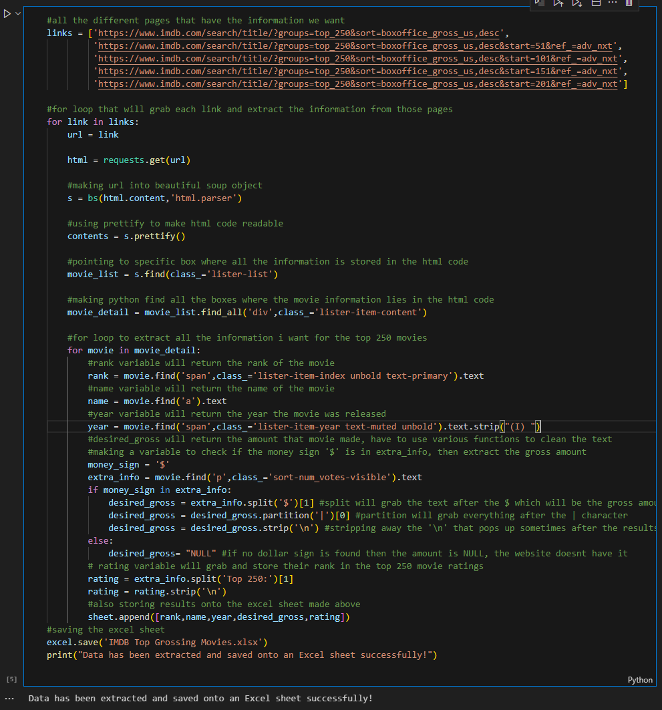
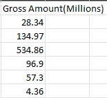
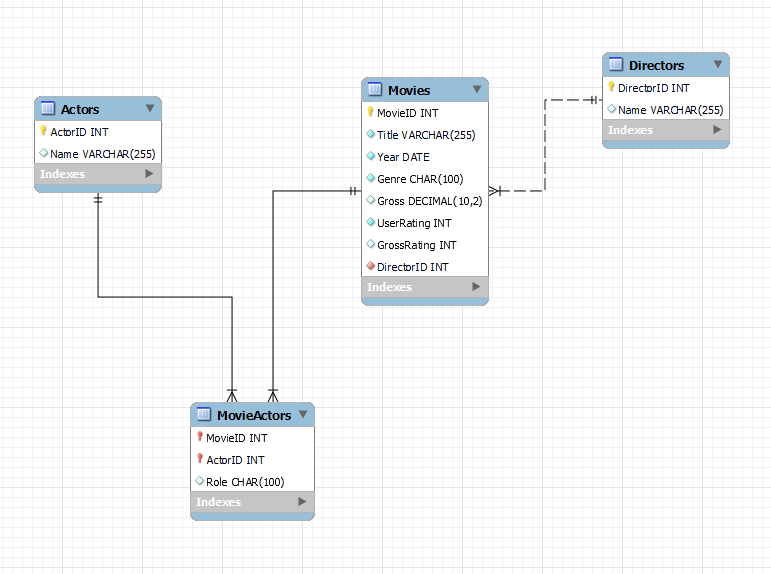
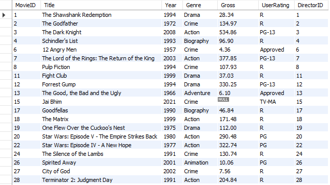
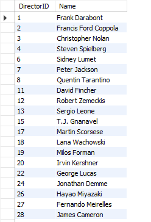
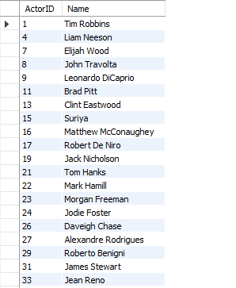
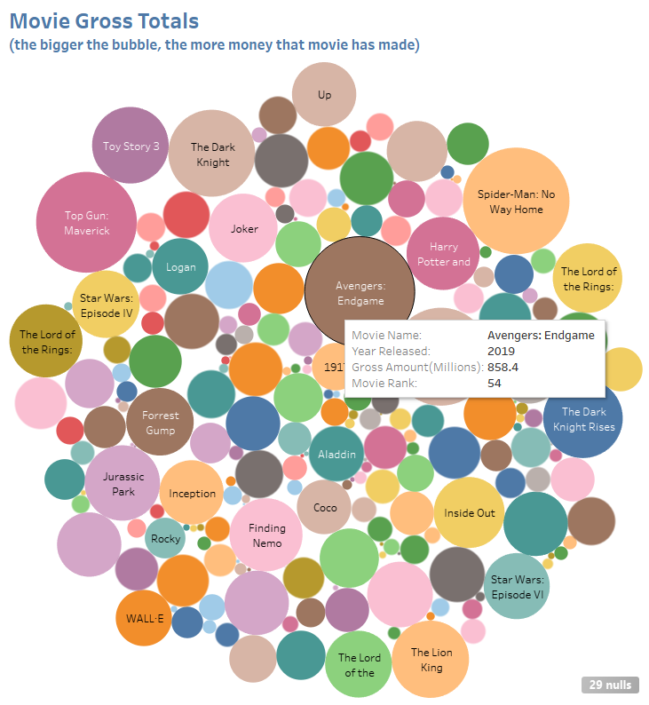
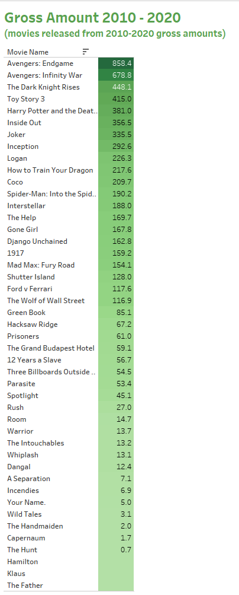
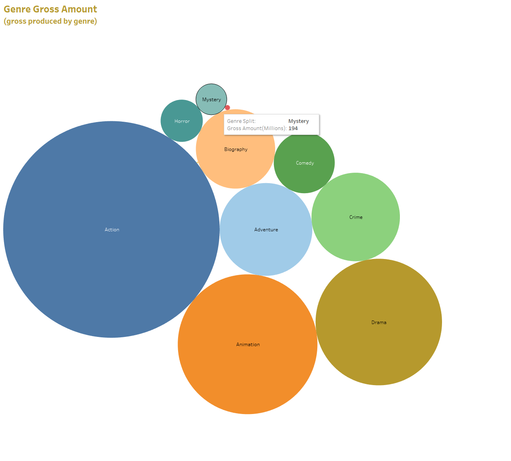

# Welcome to my Movie Analysis Project!  
This project will be about grabbing data off the IMDB website and presenting the data in different programs like SQL and Tableau. I want to show my analysis skills and also manage the database of data with my Data Engineering skills that I have learned.

The questions I want to answer are of the following:
1. Which movie made the most money?
2. Which movies are both in the top 20 in rating and gross?
3. Which movies made the most money between 2010 - 2020?
4. Which director has the most movies in the top 250? 
5. What genre is the most common in the top 250?

These are some questions we can answer using various techinques in Python and SQL. Also presenting our findings with a program like Tableau will make things easier! 
---------------------------------------------------------------------------------------------------------
I start off this project first with web scraping the IMDB website using python. Using the BeautifulSoup library, I can manipulate and grab the certain HTML elements that I want from the IMDB website like movie rank, movie name, etc.. 

After succesfully scraping the data I want, I cleaned it up a bit in Excel. Making sure columns have the right data type like for example the 'Gross' has a default data type of 'abc' so I'm chaning it to 'dec' to make it a decimal column type and have an accurate reading when the data is transfered into SQL and Tableau. 

Now I can import the data into SQL by saving the Excel sheet into a .csv file! I can use Python to do this but as I was on excel already editing the sheet and making sure the data types were correct, I can just save it with that file extension within excel itself which is a plus. 

Before I import the data, I went ahead and made a model of how the database will be. I want tables to connect with each other and make sense. The movies table is the main table here, as that connects all tables together and its the essential part of this schema. 

The schema was made with the neccessary data types for each column, now it was time to foward engineer the schema into an actual database. It was easy to do that with the built-in features that MySQL Workbench has. Once the database is created I then imported the data from the csv file we made into MySQL and these were the results:

These tables were filled with data that was pulled from the IMDB website using web scraping! Now that I had the data cleaned up, it was ready to analyze and answer some questions.

------------------------------------------------------------------------------------------------------------------------------------------------------------

Which movie made the most money?
 

Which movies released in 2010-2020 made the most money? 

What genre is the most common in the top 250? 

------------------------------------------------------------------------------------------------------------------------------------------------------------

In conclusion, there are many questions that can be answered from the data that was scraped! There's many more ways to answer the questions using the SQL database as well, it all just depends on what a company wants! 

I hope this project has showcased some of the skills that I possess and I thank you for taking the time to look through my page! 